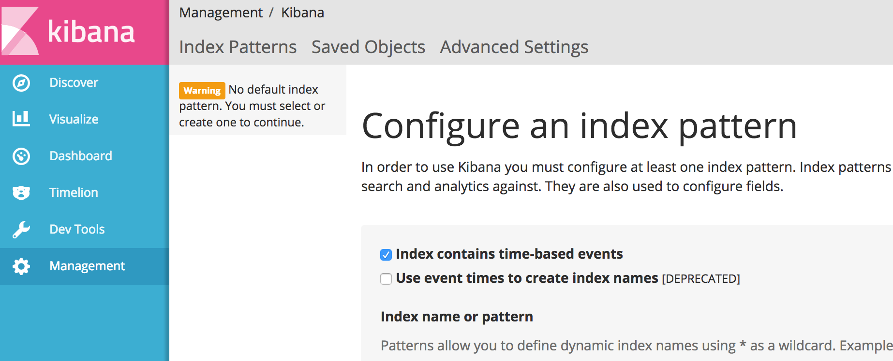

# ELK Service
[elasticsearch](https://hub.docker.com/_/elasticsearch/)
[kibana](https://hub.docker.com/_/kibana/)



## Installation
```
docker pull kibana:latest
docker pull elasticsearch:latest
```

## Configuration
```
cd elk-service
cp esconfig/elasticsearch.sample.yml esconfig/elasticsearch.yml
cp esconfig/log4j2.sample.properties esconfig/log4j2.properties
```

Update the Configurations.

## Start
```
cd elk-service
./start-elasticsearch -d
./start-kibana -d
open YOUR_IP:5061
```

## Index
### Create Document
```
PUT /twitter/tweet/3 HTTP/1.1
Host: YOUR_IP:9200
Content-Type: application/json

{
    "user" : "kimchy",
    "post_date" : "2016-11-15T14:12:16",
    "message" : " out xxx"
}
```

**twitter** Index
**tweet** Type
**3** type id


### Search Document

```
GET /twitter/tweet/_search HTTP/1.1
Host: YOUR_IP:9200
Accept: application/json
```

```
GET /twitter/tweet/_search?q=message:out HTTP/1.1
Host: YOUR_IP:9200
```

[Search in depth](https://www.elastic.co/guide/en/elasticsearch/guide/current/search-in-depth.html)

[Dealing with Human Language](https://www.elastic.co/guide/en/elasticsearch/guide/current/languages.html#languages)

[Aggregations](https://www.elastic.co/guide/en/elasticsearch/guide/current/aggregations.html)

## Security
[How to Secure Elasticsearch and Kibana](https://www.mapr.com/blog/how-secure-elasticsearch-and-kibana)

### TL;DR
```
sudo apt-get install apache2-utils nginx -yy
sudo mkdir -p /opt/elk/
sudo htpasswd -c /opt/elk/.espasswd sysadmin
```

### nginx_ensite

```
# install nginx_ensite
cd ~
git clone https://github.com/Samurais/nginx_ensite.git
cd nginx_ensite
make install

# install nginx conf
cd ~/elk-service
cp  nginx/es.conf /etc/nginx/sites-available/elk-es.xxx.net.conf
cp  nginx/kibana.conf /etc/nginx/sites-available/elk-kibana.xxx.net.conf
# update conf
nginx_ensite elk-es.xxx.net.conf
nginx_ensite elk-kibana.xxx.net.conf
sudo service nginx reload
```


## Client
[elasticsearch.js](https://www.elastic.co/guide/en/elasticsearch/client/javascript-api/current/index.html)
[Importing data into Elasticsearch](https://gist.github.com/Samurais/0da7bcbe0cc5830b118b411596f2c171)

## Further Reading
[Elasticsearch Definitive Guide](./elasticsearch-definitive-guide-en.pdf)

## Trouble Shooting
[Fielddata is disabled on text fields by default](https://www.elastic.co/guide/en/elasticsearch/reference/5.0/fielddata.html)
```
PUT /chatbot/_mapping/messageinbound/ HTTP/1.1
Host: elk-es.snaplingo.net
Content-Type: application/json
Authorization: Basic xxxxxxxxxxxxxxx

{
  "properties": {
    "fromUserId": { 
      "type":     "text",
      "fielddata": true
    }
  }
}
```